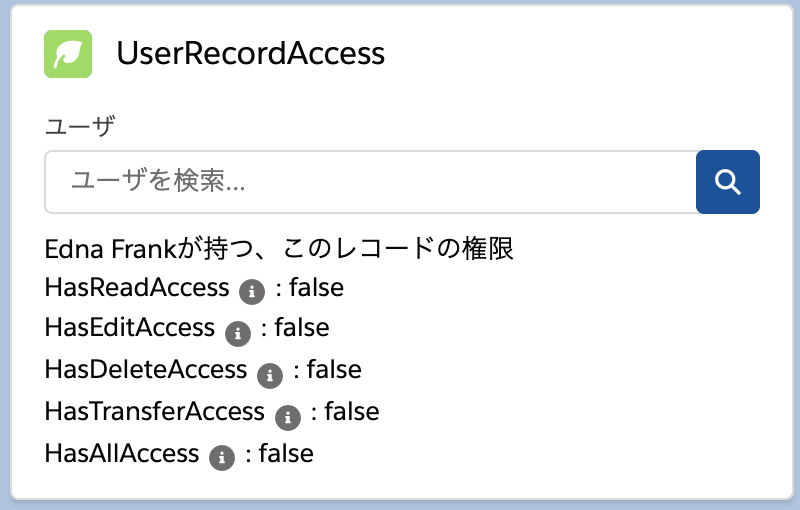
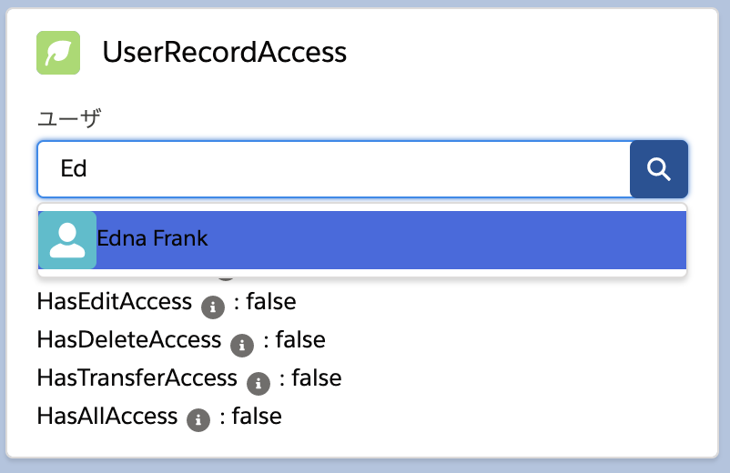

# UserRecordAccess

 ligntning component that references user access records in salesforce apex

- You can place this component on a record page.  
  
  When displayed page for the first time, show  logged on user's "UserRecordAccess".
  
- You can select a user for "user record accsess".  
  